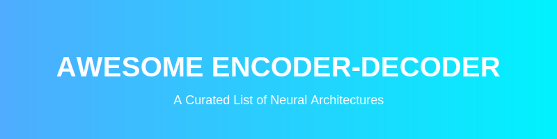

# Awesome-Encoder-Decoder 🚀

  
  
  

    
    
    
    
  

  
  
<i>A comprehensive guide to the foundational blueprint of modern AI: The Encoder-Decoder Architecture.</i>

---

## 🏗️ Encoder-Decoder Architectures in AI

The **Encoder-Decoder architecture** is a foundational blueprint in AI designed to map variable-length inputs to variable-length outputs. It processes input data into a dense bottleneck representation (the **Encoder**) and then unpacks that representation into a new format (the **Decoder**).

---

## 📊 Architectural Overview

| Model Category | Key Examples | Primary Modality | Core Mechanism | Year | First Paper | Details |
| :--- | :--- | :--- | :--- | :--- | :--- | :--- |
| **[Sequence-to-Sequence (NLP)](docs/nlp.md)** 📝 | **T5**, **BART** | Text → Text | **Transformers**: Self-attention & Cross-attention | 2014 | [Sutskever et al.](https://arxiv.org/abs/1409.3215) | [View Detail](docs/nlp.md) |
| **[Computer Vision / Segmentation](docs/vision.md)** 🖼️ | **U-Net**, **SegNet** | Image → Image | **CNNs with Skip Connections** | 2015 | [Badrinarayanan et al.](https://arxiv.org/abs/1511.00561) | [View Detail](docs/vision.md) |
| **[Multimodal / Vision-Language](docs/multimodal.md)** 🎧 | **Whisper**, **BLIP-2** | Image/Audio → Text | **Cross-Attention Bottlenecks** | 2014 | [Vinyals et al.](https://arxiv.org/abs/1411.4555) | [View Detail](docs/multimodal.md) |
| **[Generative Modeling](docs/generative.md)** 🎨 | **VAEs** | Data → Latent → Data | **Probabilistic Latents** | 2013 | [Kingma & Welling](https://arxiv.org/abs/1312.6114) | [View Detail](docs/generative.md) |

---

## 🌟 Key Architectures & Implementations

### 1. Sequence-to-Sequence NLP (The Transformer Pioneers) ✍️

#### T5 (Text-to-Text Transfer Transformer) by Google
* **Mechanism:** T5 treats every NLP task as a text-to-text problem. The encoder processes the input text prompt, and the decoder autoregressively generates the text target token-by-token.
* **Impact:** It unified disparate tasks (classification, regression, translation) into a single encoder-decoder framework.

#### BART by Meta
* **Mechanism:** BART uses a bidirectional encoder (like BERT) to analyze corrupted or masked text, and a left-to-right autoregressive decoder (like GPT) to reconstruct the original text.
* **Impact:** It excels at text generation tasks where the model needs a deep, holistic understanding of the source text.

### 2. Computer Vision (The Spatial Mappers) 🔍

#### U-Net
* **Mechanism:** The encoder uses a series of convolutional layers to aggressively downsample the image. The decoder mirrors this by upsampling features back to the original dimensions.
* **The "Skip Connections" Innovation:** U-Net passes precise spatial information directly from encoder layers to corresponding decoder layers.
* **Impact:** Revolutionary for medical image segmentation and the backbone of modern Diffusion models.

### 3. Multimodal & Audio (The Cross-Modality Translators) 🌐

#### OpenAI Whisper
* **Mechanism:** The encoder takes an audio spectrogram; the decoder acts as a language model, processing these features via cross-attention to output text.
* **Impact:** The industry benchmark for robust, multilingual speech-to-text.

#### BLIP-2 / Vision-Language Models
* **Mechanism:** A frozen image encoder extracts visual tokens, which are mapped to a text-aligned latent space and then decoded by an LLM.
* **Impact:** Enables AI to reason about images, VQA, and captioning.

### 4. Generative AI (The Latent Space Explorers) 🧪

#### Variational Autoencoders (VAEs)
* **Mechanism:** The encoder compresses input into a continuous probability distribution. The decoder samples from this distribution to reconstruct or generate variations.
* **Impact:** Critical component in Latent Diffusion Models (e.g., Stable Diffusion) for image compression.
