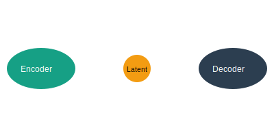

# Generative Modeling (VAEs)

**Variational Autoencoders (VAEs)** are generative models that map data to a continuous latent space.

## Overview
The encoder maps inputs to a probability distribution (latent space), and the decoder samples from this space to reconstruct the input or generate new data.

## Diagram

## Seminal Papers
- **2013:** [Auto-Encoding Variational Bayes](https://arxiv.org/abs/1312.6114) (Kingma & Welling)

[Back to README](../README.md)
