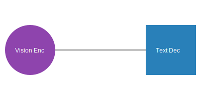

# Multimodal / Vision-Language

**Multimodal Encoder-Decoders** bridge different types of data, such as images or audio, with text.

## Overview
A modality-specific encoder (e.g., a ViT for images or a CNN for audio) extracts features which are then fused or cross-attended to by a text decoder to generate natural language descriptions.

## Diagram

## Seminal Papers
- **2014:** [Show and Tell: A Neural Image Caption Generator](https://arxiv.org/abs/1411.4555) (Vinyals et al.)
- **2022:** [Whisper: Robust Speech Recognition via Large-Scale Weak Supervision](https://arxiv.org/abs/2212.04356) (Radford et al.)

[Back to README](../README.md)
