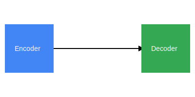

# Sequence-to-Sequence (NLP)

The **Sequence-to-Sequence (Seq2Seq)** architecture is designed to map an input sequence to an output sequence of variable length.

## Overview
Initially popularized for Neural Machine Translation, it typically uses an RNN (LSTM/GRU) or Transformer-based encoder to process the source text into a context vector, which the decoder then uses to generate the target text.

## Diagram

## Seminal Papers
- **2014:** [Sequence to Sequence Learning with Neural Networks](https://arxiv.org/abs/1409.3215) (Sutskever et al.)
- **2014:** [Learning Phrase Representations using RNN Encoder–Decoder for Statistical Machine Translation](https://arxiv.org/abs/1406.1078) (Cho et al.)

[Back to README](../README.md)
