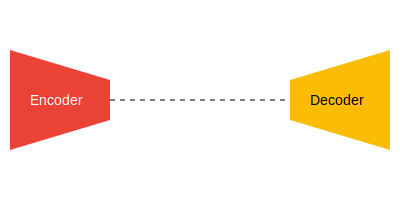

# Computer Vision / Segmentation

The **Encoder-Decoder** architecture in Computer Vision is primarily used for tasks like semantic segmentation where pixel-level classification is required.

## Overview
The encoder (usually a CNN) downsamples the image to extract high-level features, while the decoder upsamples these features back to the original resolution, often using skip connections to preserve spatial details.

## Diagram

## Seminal Papers
- **2015:** [U-Net: Convolutional Networks for Biomedical Image Segmentation](https://arxiv.org/abs/1505.04597) (Ronneberger et al.)
- **2015:** [SegNet: A Deep Convolutional Encoder-Decoder Architecture for Image Segmentation](https://arxiv.org/abs/1511.00561) (Badrinarayanan et al.)

[Back to README](../README.md)
